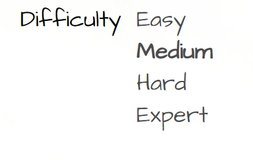
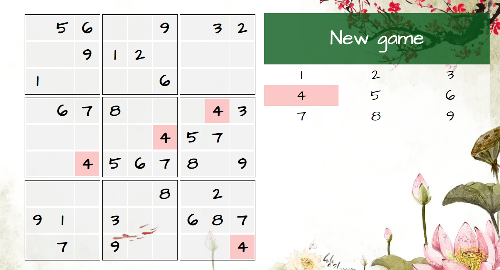
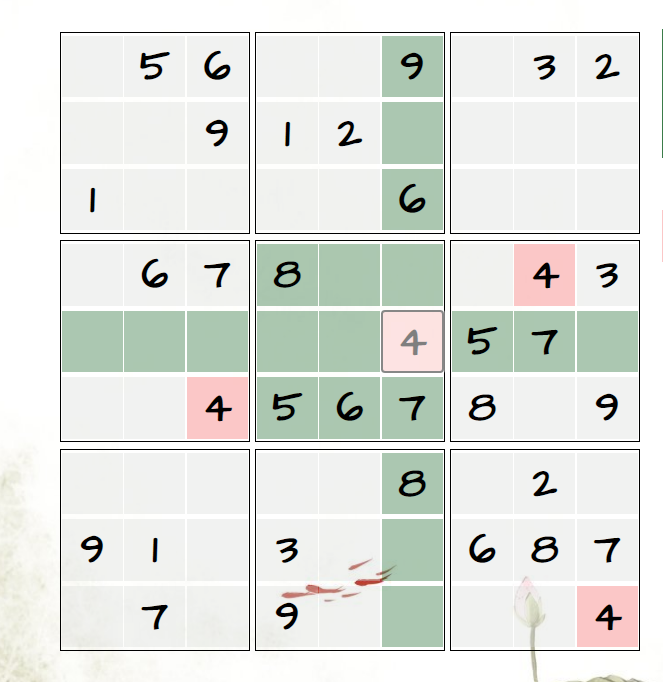

# Привет, друг! 😊

Это моя первая игра не react "Sudoku".
В дальнейшем, возможно, будут доработки. Но пока вот .... Держи мое детище 

Ноо.... лучше я расскажу, как это устроено.. 😳

## Это уровни сложности

Я думаю, несложно догадаться, что и как тут. 

## Еще у тебя есть три  жизни

Они выглядят вот так. Таам. Вверху, если присмотреться. 😊
Лааадно, вот так это выгляит 

Если ты случайно сделаешь ошибку, одна пропадет. Не волнуйся, если все закончатся. А не успела сделать взрывы. 😭 просто начнешь новую игру и всё. 

Таак.. Дальше.. 
Есть кнопка для новый игры и панелька с циферками. Она такая большая, что нет смысла вставлять картинку.

## Кстати! Зацени эту красоту! Она просто шедевр!!!

Это такая красота. Уххх...
Если случайно обновил страницу, то вроде, все должно остаться...

Если для тебя это не очень красиво.. То у тебя корона, сходи к врачу 😒

Кстати, кстати, если выбрать цифру и нажать на поле, то она вставится. Не забудь это, можешь потерять жизни, если тыкнешь просто так. В обратную сторону это не работает!

Если цифра бессит, просто нажми на нее еще раз. 

## Еще в игре есть самый модный хит. Бери друзей и тусуйтесь до утра. Он реально вставляет. 

Скрыла в траве, чтобы этот хит не нашли.. Но ты это прочитал и быстрой его найдешь. Ты молодец! Просто послушай этот бит... 🤘

Ну и, конечно, внизу есть ссылочки. 

Ура! Ты все прочитал! Я бы еще что-нибудь написала, но лень.. 😐

## Ну, все, приятной игры. Вот ссылочка <a href="demo/index.html">Sudoku</a> 🐣

